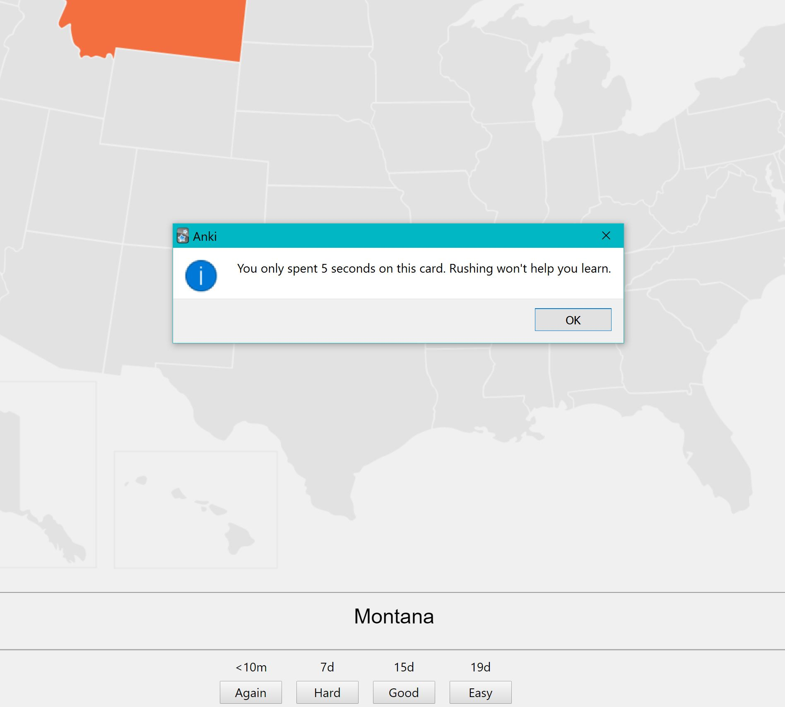
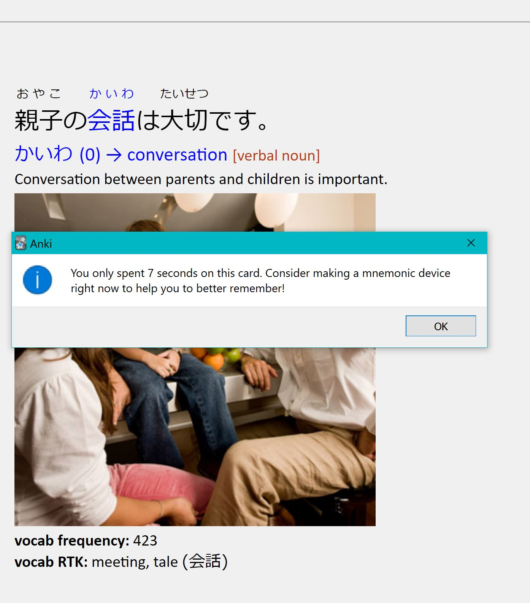
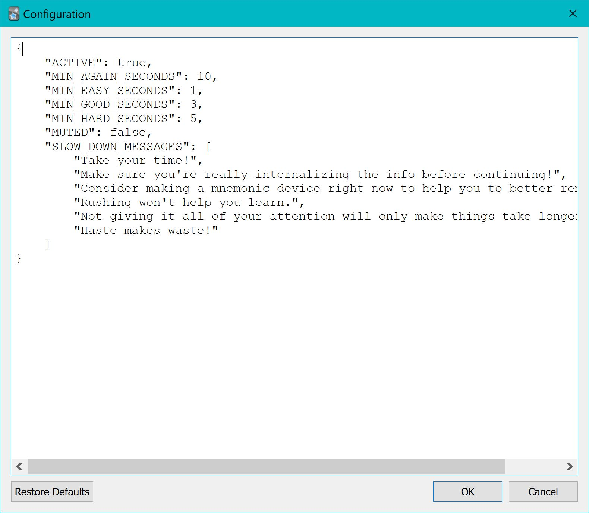

# Anki Speed Limit
Anki Speed Limit is an Anki add-on stopping and reminding the user to not rush through their Anki reviews without thinking them through. Depending on the user-reported difficulty (ease) of the card, the add-on will alert the user with both an optional sound effect and a pop-up detailing how long the user viewed the card, along with advice to slow down. This is to ensure that one does not spend time mindlessly flipping through and performing poorly on cards without meaningfully learning from them.

Settings can be adjusted through `config.json`, including:
- How long an acceptable review time is at each difficulty/ease
- Whether the sound effect should be muted
- What encouraging (or chastising) messages the add-on may choose to display

#### Screenshots

[Anki](https://apps.ankiweb.net/) is a free, open-source flashcard application using a Spaced Repetition System to optimize one's review schedule.